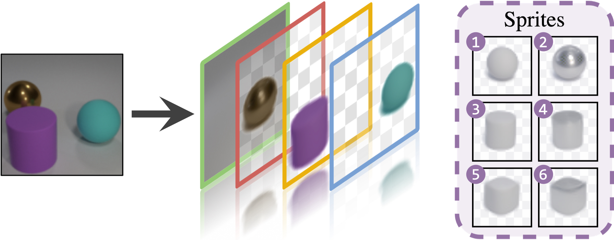
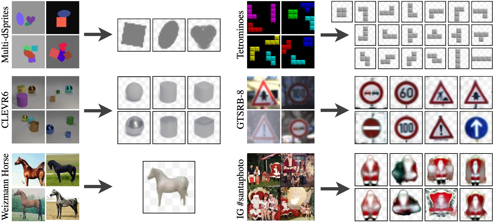

# DTI-Sprites

Pytorch implementation of [**"Unsupervised Layered Image Decomposition into Object Prototypes"**](https://arxiv.org/abs/2104.14575) paper (accepted to ICCV 2021)

Check out our [**paper**](https://openaccess.thecvf.com/content/ICCV2021/papers/Monnier_Unsupervised_Layered_Image_Decomposition_Into_Object_Prototypes_ICCV_2021_paper.pdf) and [**webpage**](https://www.tmonnier.com/DTI-Sprites/) for details!



If you find this code useful, don't forget to star the repo ⭐ and cite the paper:

```
@inproceedings{monnier2021dtisprites,
  title={{Unsupervised Layered Image Decomposition into Object Prototypes}},
  author={Monnier, Tom and Vincent, Elliot and Ponce, Jean and Aubry, Mathieu},
  booktitle={ICCV},
  year={2021},
}
```

## Installation :construction_worker:

### 1. Create conda environment

```
conda env create -f environment.yml
conda activate dti-sprites
```

**Optional:** some monitoring routines are implemented, you can use them by specifying the 
visdom port in the config file. You will need to install `visdom` from source beforehand

```
git clone https://github.com/facebookresearch/visdom
cd visdom && pip install -e .
```

### 2. Download non-torchvision datasets

```
./download_data.sh
```

This command will download following datasets:

- `Tetrominoes`, `Multi-dSprites` and `CLEVR6` ([link](https://github.com/deepmind/multi_object_datasets/) to the original repo multi-object datasets with raw tfrecords)
- `GTSRB` ([link](https://benchmark.ini.rub.de/gtsrb_dataset.html) to the original dataset page)
- `Weizmann Horse database` ([link](https://avaminzhang.wordpress.com/2012/12/07/%E3%80%90dataset%E3%80%91weizmann-horses/) to the original dataset page)
- `Instagram collections` associated to [#santaphoto](https://www.instagram.com/explore/tags/santaphoto/) and [#weddingkiss](https://www.instagram.com/explore/tags/weddingkiss/) ([link](https://github.com/monniert/dti-clustering) to the original repo 
  with datasets links and descriptions)

**NB:** it may happen that `gdown` hangs, if so you can download them by hand with following 
gdrive links, unzip and move them to the `datasets` folder:

- [Tetrominoes gdrive link](https://drive.google.com/file/d/1unCVwJbytG1wHZCQfk41otdtmR8yU1AH/view?usp=sharing)
- [Multi-dSprites gdrive link](https://drive.google.com/file/d/110RrDlhx_fjXymzmTx1nkC3ZMPmMXjsv/view?usp=sharing)
- [CLEVR6 gdrive link](https://drive.google.com/file/d/12c7ZRNWKzqosz5aUOfL0XBmLHrcN240r/view?usp=sharing)
- [GTSRB gdrive link](https://drive.google.com/file/d/1d5rlgYeH087oT6AnTNAHtwrnRXv3WeRR/view?usp=sharing)
- [Weizmann Horse gdrive link](https://drive.google.com/file/d/1fQSWQUCwIB6zkA65D4wlbaGmIg8iO6Ja/view?usp=sharing)
- [IG santaphoto gdrive link](https://drive.google.com/file/d/1tv5-\_Iz-LD6-FqFxF67py9ot97BOZbUc/view?usp=sharing)
- [IG weddingkiss gdrive link](https://drive.google.com/file/d/1OCLvojYDomLnI6zP6QghgIkZ8PWwmqCD/view?usp=sharing)

## How to use :rocket:

### 1. Launch a training

```
cuda=gpu_id config=filename.yml tag=run_tag ./pipeline.sh
```

where:
- `gpu_id` is a target cuda device id,
- `filename.yml` is a YAML config located in `configs` folder,
- `run_tag` is a tag for the experiment.

Results are saved at `runs/${DATASET}/${DATE}_${run_tag}` where `DATASET` is the dataset name 
specified in `filename.yml` and `DATE` is the current date in `mmdd` format. Some training 
visual results like sprites evolution and reconstruction examples
will be saved. Here is an example from Tetrominoes dataset:

#### Reconstruction examples


#### Sprites evolution and final


More visual results are available at https://imagine.enpc.fr/~monniert/DTI-Sprites/extra_results/.

### 2. Reproduce our quantitative results 

To launch 5 runs on Tetrominoes benchmark and reproduce our results:
```
cuda=gpu_id config=tetro.yml tag=default ./multi_pipeline.sh
```

Available configs are:

- Multi-object benchmarks: `tetro.yml`, `dsprites.yml`, `clevr6.yml`
- Clustering benchmarks: `gtsrb8.yml`, `svhn.yml`
- Co-segmentation dataset: `horse.yml`

### 3. Reproduce our qualitative results on Instagram collections

1. (**skip if already downloaded with script above**) Create a santaphoto dataset by running 
   `process_insta_santa.sh` script. It can take a while to scrape the 10k posts from Instagram.
2. Launch training with `cuda=gpu_id config=instagram.yml tag=santaphoto ./pipeline.sh`

That's it! Overall you should end up with the following qualitative results:

#### Automatically discovered sprites 



## Further information

If you like this project, please check out related works on deep transformations from our group:

- [Monnier et al. - Deep Transformation Invariant Clustering (NeurIPS 2020)](https://arxiv.org/abs/2006.11132)
- [Deprelle et al. - Learning elementary structures for 3D shape generation and matching (NeurIPS 2019)](https://arxiv.org/abs/1908.04725)
- [Groueix et al. - 3D-CODED: 3D Correspondences by Deep Deformation (ECCV 2018)](https://arxiv.org/abs/1806.05228)
- [Groueix et al. - AtlasNet: A Papier-Mache Approach to Learning 3D Surface Generation (CVPR 2018)](https://arxiv.org/abs/1802.05384)
